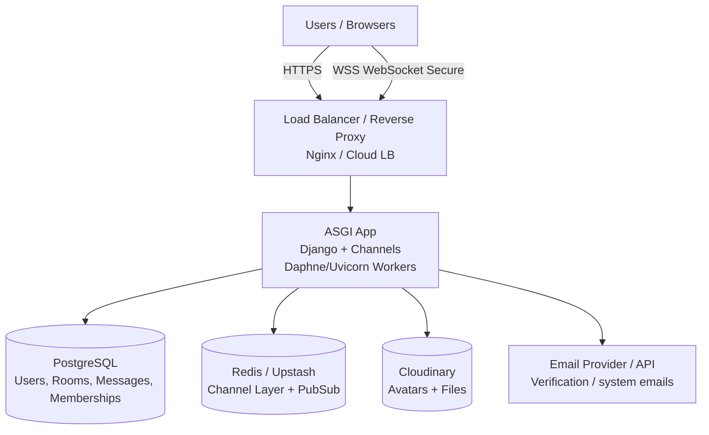
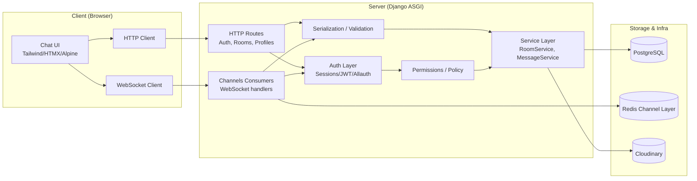
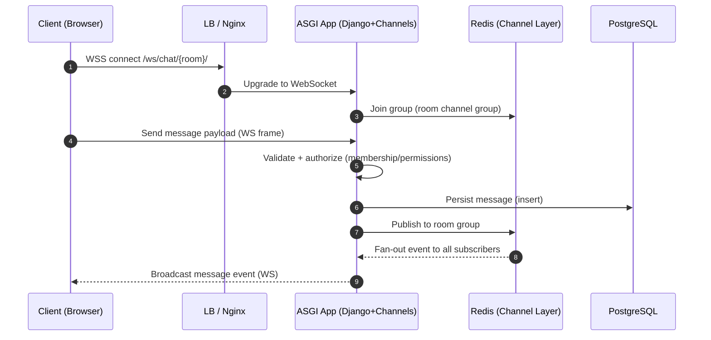
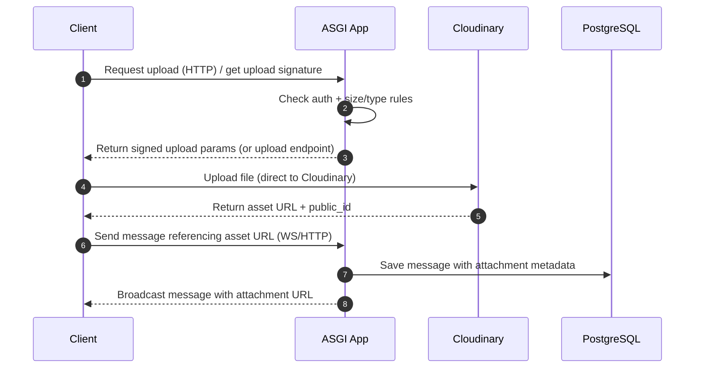
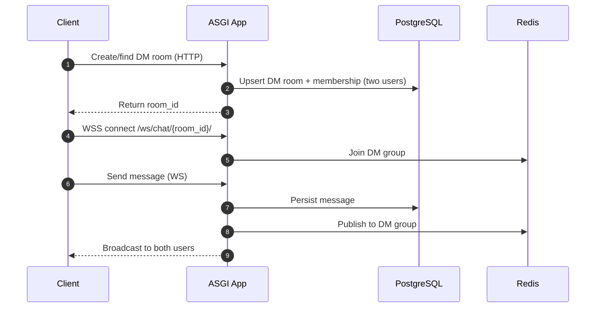
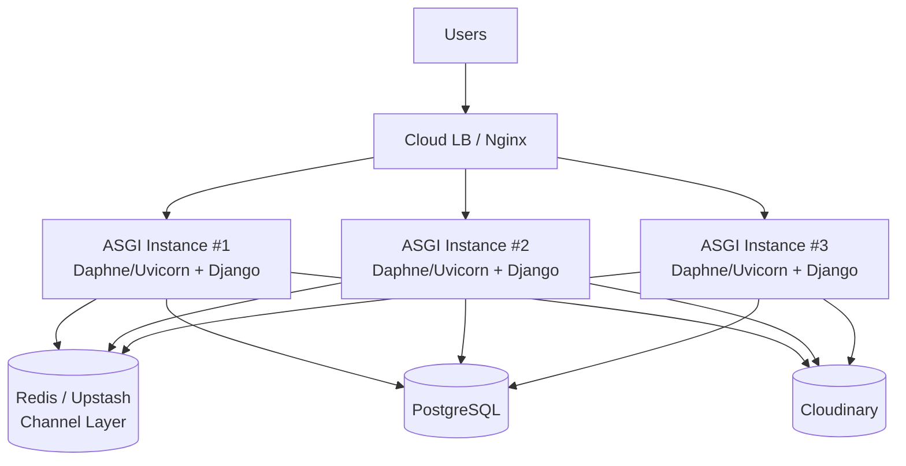
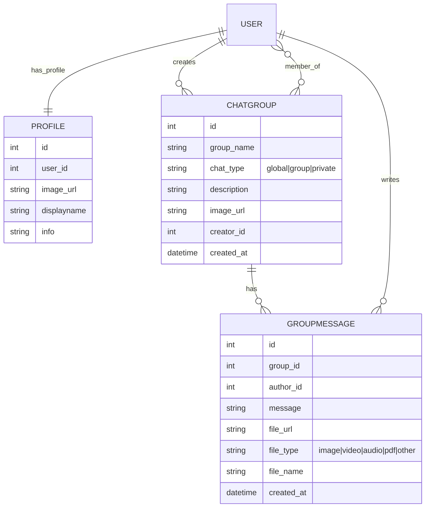

<div align="center">

<a href="https://github.com/Sumit0ubey/Pinggo">
  
</a>

<br/>

<p>
  <a href="https://github.com/Sumit0ubey/Pinggo/repo-size">
    
  </a>
  <a href="https://github.com/Sumit0ubey/Pinggo/stargazers">
    
  </a>
  <a href="https://github.com/Sumit0ubey/Pinggo/blob/main/LICENSE">
    
  </a>
</p>

<p>
  <a href="http://143.244.132.69/">
    
  </a>
  <a href="https://github.com/Sumit0ubey/Pinggo">
    
  </a>
  
</p>


<p>
  
  
  
  
  
  
  
  
  
</p>


<h3>⚡ Real-Time Conversations. Engineered for Scale.</h3>
<p>Global • Group • Private messaging — built on Django + WebSockets with a production-ready ASGI architecture.</p>

</div>

---

## 📌 Table of Contents

- [✨ Overview](#-overview)
- [🚀 Why Pinggo?](#-why-pinggo)
- [🧩 Features](#-features)
- [🏗 System Design](#-system-design)
  - [1) High-Level](#1-high-level)
  - [2) Low-Level](#2-low-level)
  - [3) Data Flow](#3-data-flow)
  - [4) Deployment & Scaling](#4-deployment--scaling)
  - [5) Database ER](#5-database-er)
- [🛠 Tech Stack](#-tech-stack)
- [📦 Project Structure](#-project-structure)
- [⚙️ Getting Started](#️-getting-started)
- [🌩 Environment Variables](#-environment-variables)
- [🚢 Production Deployment](#-production-deployment)
- [🧪 Security & Best Practices](#-security--best-practices)
- [🗺 Roadmap](#-roadmap)
- [🤝 Contributing](#-contributing)
- [👨‍💻 Author](#-author)
- [📄 License](#-license)

---

## ✨ Overview

**Pinggo** is a real-time chat platform designed to deliver smooth, instant messaging across:

- 🌍 **Global chat**
- 👥 **Group rooms**
- 🔐 **Private 1:1 DMs**
- 🖼 **Media sharing** (Cloudinary)

It’s built like a deployable product: **ASGI-first**, **Redis channel layer**, **PostgreSQL storage**, and a modern UI stack for responsive interactions.

**Live:** http://143.244.132.69/  

---

## 🚀 Why Pinggo?

- **Realtime-first**: WebSocket messaging using Django Channels
- **Scales horizontally**: Redis/Upstash for the channel layer fan-out
- **Production-ready**: ASGI + Daphne/Uvicorn compatible deployment
- **Cloud media**: Cloudinary for avatars and attachments
- **Modern UI**: Tailwind + HTMX + Alpine.js for app-like experience

---

## 🧩 Features

### Messaging
- ✅ Real-time messaging via WebSockets  
- ✅ Global / Group / Private rooms  
- ✅ Room-based broadcast delivery  
- ✅ Persistent history in PostgreSQL  

### Media
- ✅ User avatars  
- ✅ Group avatars  
- ✅ File uploads / attachments  
- ✅ Cloudinary integration  

### Infrastructure-ready
- ✅ ASGI deployment support  
- ✅ Redis channel layer for scale  
- ✅ Clear separation of routes/consumers/services  

---

# 🏗 System Design

## 1) High-Level



---

## 2) Low-Level



---

## 3) Data Flow

### 3A) WebSocket Message Send (Room/Group/Global)



### 3B) File Upload / Media Share (Cloudinary)



### 3C) Private Chat Initiation (1:1)



---

## 4) Deployment & Scaling



---

## 5) Database ER



---

## 🛠 Tech Stack

### Backend
- Django
- Django Channels (WebSockets)
- ASGI + Daphne/Uvicorn
- PostgreSQL
- Redis / Upstash Redis

### Frontend
- HTML5
- Tailwind CSS
- HTMX
- Alpine.js
- JavaScript

### Media
- Cloudinary

---

## 📦 Project Structure

```
Pinggo/
│
├── chats/                # Chat related files and configuration
├── home/                 # Simple app for redirection
├── MailApix/             # app for configuring MailAPIX API as an email backed
├── Pinggo/               # Django project core
├── static/               # Static files folder
├── templates/            # Html files folder
├── users/                # app for user authentication and authorization
├── __init__.py
├── manage.py
├── .env
└──  requirements.txt                 
```

---

## ⚙️ Getting Started

### 1) Clone & install

```bash
git clone https://github.com/Sumit0ubey/Pinggo.git
cd Pinggo

python -m venv venv
# Windows:
venv\Scripts\activate
# macOS/Linux:
source venv/bin/activate

pip install -r requirements.txt
```

### 2) Migrate DB

```bash
python manage.py makemigrations
python manage.py migrate
```

### 3) Run locally

```bash
python manage.py runserver
```

---

## 🌩 Environment Variables

Create `.env` based on `.env.example`.

```env
DEBUG=True
SECRET_KEY=your_secret_key
APP_NAME=Pinggo

# Database
DATABASE_HOST=
DATABASE_PORT=
DATABASE_NAME=
DATABASE_USER=

# Redis / Upstash
UPSTASH_REDIS_URL=

# Cloudinary
CLOUDINARY_CLOUD_NAME=
CLOUDINARY_API_KEY=
CLOUDINARY_API_SECRET=

# Optional folders
CLOUDINARY_USER_AVATAR=
CLOUDINARY_GROUP_AVATAR=
CLOUDINARY_CHAT_FILES=
```

---

## 🚢 Production Deployment

### Run ASGI with Daphne

```bash
daphne -b 0.0.0.0 -p 8000 Pinggo.asgi:application
```

### Recommended production setup
- Nginx reverse proxy (TLS termination)
- PostgreSQL managed DB
- Upstash Redis (channel layer)
- Cloudinary for media
- `DEBUG=False` and restricted `ALLOWED_HOSTS`

---

## 🧪 Security & Best Practices

- ✅ Keep secrets in environment variables
- ✅ Use `DEBUG=False` in production
- ✅ Validate message payloads server-side
- ✅ Add rate limiting (WS + HTTP) for abuse prevention
- ✅ Restrict allowed file types/sizes before upload
- ✅ Use HTTPS/WSS everywhere

---

## 🗺 Roadmap

- Read receipts ✅/👀  
- Typing indicators ✍️  
- Reactions ❤️🔥  
- Push notifications 🔔  
- Search 🔎  
- Moderation tools 🛡  
- Optional E2E encryption 🔐  

---

## 🤝 Contributing

1. Fork the repo  
2. Create a branch: `git checkout -b feature/amazing-feature`  
3. Commit changes: `git commit -m "Add amazing feature"`  
4. Push: `git push origin feature/amazing-feature`  
5. Open a PR 🎉  

---

## 👨‍💻 Author

**Sumit Dubey**  
GitHub: https://github.com/Sumit0ubey

---

## 📄 License

This project is licensed under the MIT License.

See the [LICENSE](./LICENSE) file for details.

---

<div align="center">

### 💬 Pinggo — Built for Conversations that Matter

</div>
